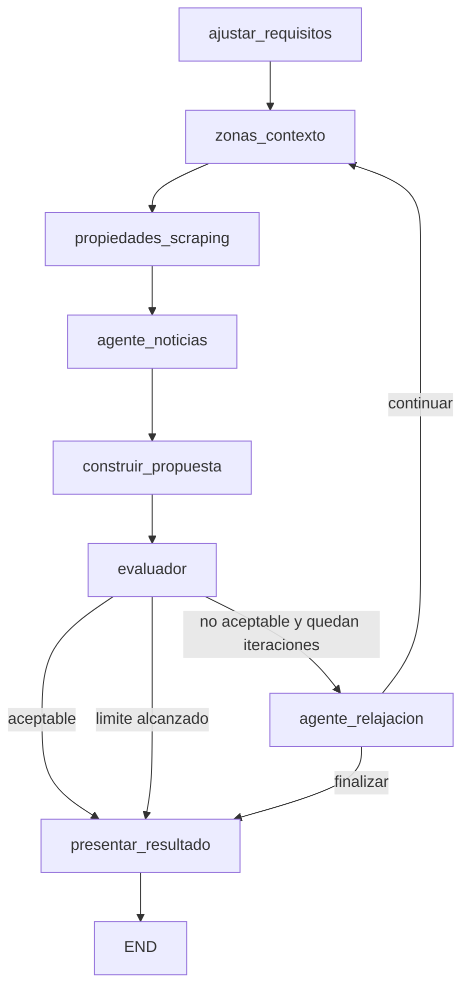

# Sistema de recomendación inteligente de vivienda 🏠

Este proyecto implementa un sistema inteligente para recomendar opciones de vivienda a familias dentro de una ciudad a partir de preferencias iniciales, que pueden ser explicitas o derivadas desde texto libre. El sistema integra criterios del usuario, contexto de zonas, señales externas como noticias o informacion urbana, y fuentes de oferta inmobiliaria.

La decision de diseño principal es no construir un único agente autónomo que controle todo. En su lugar, el sistema usa un grafo de estados con etapas claras, estado compartido, transiciones condicionales y ciclos controlados de reintento. Esto mejora la interpretabilidad: se puede ver qué nodo produjo cada dato, porqué una propuesta fue rechazada y qué requisito se relajó.

## Estado actual de cumplimiento 🫡

El proyecto cumple el patrón requerido mediante `LangGraph` en `housing_recommender/graph/builder.py`. El flujo no es lineal: después de evaluar la propuesta, el grafo puede presentar resultados o activar relajación y volver a buscar.

Componentes cubiertos:

- **Preferencias del usuario:** `ajustar_requisitos` interpreta texto libre o requisitos estructurados.
- **Información de zonas:** `zonas_contexto` identifica zonas analizadas y seleccionadas.
- **Señales externas:** `agente_noticias` consulta contexto urbano/noticias.
- **Oferta inmobiliaria:** `propiedades_scraping` consulta proveedores configurables y usa mock como respaldo.
- **Evaluación final:** `evaluador` decide si la propuesta es aceptable.
- **Iteración bajo incertidumbre:** `agente_relajacion` modifica requisitos gradualmente y registra historial.
- **Salida explicada:** `presentar_resultado` genera recomendaciones, explicaciones, score, diagnóstico y cambios aplicados.

## Arquitectura 𖠿

El sistema esta organizado por responsabilidades:

- `housing_recommender/state/models.py`: modelos Pydantic del dominio y `AgentState`.
- `housing_recommender/graph/builder.py`: construcción del grafo LangGraph.
- `housing_recommender/graph/conditions.py`: decisiones condicionales del flujo.
- `housing_recommender/graph/nodes.py`: nodos conectados al grafo y actividad de zonas.
- `housing_recommender/nodes/`: implementaciones funcionales de cada actividad.
- `housing_recommender/services/`: clientes de LLM, scraping, noticias y parser local.
- `housing_recommender/main.py`: punto de entrada de ejecución.

## Definición del estado ᯤ

El estado compartido es `AgentState`. Captura la evolución completa del proceso:

| Campo | Propósito |
| --- | --- |
| `textoUsuario` | Entrada original en lenguaje natural. |
| `requisitos_originales` | Criterios iniciales congelados para trazabilidad. |
| `requisitos` | Criterios actuales, modificables durante relajación. |
| `zonas_analizadas` | Zonas consideradas según ubicación/contexto. |
| `zonas_seleccionadas` | Zonas priorizadas para busqueda. |
| `propiedades` | Resultados brutos normalizados desde fuentes inmobiliarias. |
| `propiedades_filtradas` | Subconjunto que cumple los requisitos actuales. |
| `noticias` | Senales externas sobre zonas o mercado. |
| `diagnostico_noticias` | Metadatos del proveedor de noticias/contexto. |
| `propuesta` | Alternativas recomendadas con score global. |
| `evaluacion` | Resultado del evaluador: aceptable, score, razón y recomendación de relajación. |
| `historial_relajacion` | Cambios realizados por iteración. |
| `nivel_relajacion_aplicado` | Magnitud agregada de la relajación frente a requisitos originales. |
| `diagnostico` | Fallos, incompatibilidades o decisiones relevantes. |
| `recomendaciones_finales` | Alternativas formateadas para el usuario. |
| `explicaciones` | Explicaciones finales del proceso. |
| `iteracion`, `max_iteraciones` | Control del ciclo de reintentos. |

La separación entre `requisitos_originales` y `requisitos` permite explicar qué se pidió inicialmente y qué condiciones fueron necesarias para encontrar alternativas.

## Diagrama del grafo 👾



## Actividades e implementación 🛠️

`ajustar_requisitos`

Interpreta la entrada del usuario y produce un objeto `Requisito`. La entrada puede ser texto plano, por ejemplo "busco apartamento hasta 430 millones", o un diccionario estructurado. Esto responde a la consigna de preferencias explicitas o implicitas. Usa `generar_json_estructurado` si hay proveedor LLM configurado; si no, cae al parser local `extraer_requisitos_desde_texto`. Tambien normaliza alias comunes como `habitaciones_min`, `zonas_preferidas`, `presupuesto` o `area`, y guarda `requisitos_originales`.

`zonas_contexto`

Traduce ubicaciones amplias como `sur`, `occidente` o `poblado` a zonas concretas. Si no hay ubicación, usa un conjunto general de zonas de Medellin. Esta actividad justifica la incorporación de zonas/barrios aunque no dependa de una API externa.

`propiedades_scraping`

Consulta fuentes de oferta inmobiliaria mediante `obtener_propiedades`. El proveedor se configura en `settings.scraping_provider` y puede ser `mock`, `fincaraiz`, `metrocuadrado`, `ciencuadras` o `mixto`. Si una fuente real no entrega resultados, el servicio puede usar datos mock para permitir pruebas reproducibles.

`agente_noticias`

Obtiene noticias o contexto urbano para las ubicaciones encontradas. También conserva diagnóstico del proveedor usado.

`construir_propuesta`

Filtra propiedades contra los requisitos actuales, calcula score individual y construye una `Propuesta` con las mejores alternativas. El score considera cumplimiento de precio, área, tipo, habitaciones, baños, parqueadero, administración y ajuste por señales externas cuando existen.

`evaluador`

Evalua si la propuesta es aceptable. Lee `propuesta`, `propiedades` y `requisitos`. Si no hay propiedades o no hay candidatas, registra diagnóstico y recomienda qué campo relajar.

`agente_relajacion`

Modifica gradualmente `requisitos` cuando la evaluación no es aceptable. No cambia muchas variables a la vez: prioriza el campo recomendado por el evaluador y, si no hay recomendación, alterna entre precio, área y habitaciones. Cada cambio queda en `historial_relajacion`.

`presentar_resultado`

Genera la salida final: alternativas, explicaciones, score de evaluación, noticias/contexto, diagnóstico y cambios hechos a las condiciones iniciales.

## Logica de decisión e iteración 💡

La decisión principal ocurre después de `evaluador`:

- Si `evaluacion.es_aceptable` es verdadero, el flujo pasa a `presentar_resultado`.
- Si no es aceptable e `iteracion < max_iteraciones`, pasa a `agente_relajacion`.
- Si se alcanza el límite, se presenta el mejor estado disponible con diagnóstico.

Después de relajar, el grafo vuelve a `zonas_contexto`, repite búsqueda, noticias, propuesta y evaluación. Esto implementa un ciclo controlado de reintentos.

## Estrategia de relajación ⚡

La relajación está en `housing_recommender/nodes/agente_relajacion.py`.

Reglas actuales:

- `precio_max`: aumenta 10%.
- `area_min`: reduce 10%.
- `habitaciones`: reduce en 1 si es mayor que 1.
- `ubicacion`: puede eliminarse para ampliar zonas.
- `tipo`: puede eliminarse para permitir otros tipos de vivienda.

El agente evita cambios bruscos porque aplica un cambio principal por iteración. Cada modificación registra:

- iteración
- campo relajado
- valor antes
- valor después
- descripción legible

El sistema se detiene al encontrar una propuesta aceptable o al alcanzar `max_iteraciones`.

## Evaluación final 💻

El componente `evaluador` actúa antes de presentar resultados. Su salida incluye:

- `es_aceptable`
- `score` de 0 a 10
- `razon`
- `recomendacion` de campo a relajar

Si la propuesta no es coherente o no satisface suficientemente los requisitos, solicita una nueva iteración mediante la transición condicional del grafo.

## Ejemplo de ejecución 👨🏻‍💻

Desde la raíz del proyecto:

```powershell
python -m housing_recommender.main
```

También se puede ejecutar desde la carpeta del paquete:

```powershell
cd housing_recommender
python main.py
```

Ejemplo de entrada en texto plano usada en `main.py`:

```python
criterios_ejemplo = (
    "Busco apartamento hasta 540 millones, con 2 habitaciones "
    "para una familia en Medellin."
)
```

Salida esperada, resumida:

```text
RESULTADOS DE LA BUSQUEDA DE VIVIENDA

RESUMEN:
- Requisitos originales: ...
- Requisitos usados: ...
- Evaluacion ... con score .../10
- Relajacion aplicada: ...
- Nivel de relajacion aplicado: ...
- Noticias/contexto: ...
- Diagnostico: ...

RECOMENDACIONES:
- 1. apartamento en ... | precio ... | area ... | score ...
```

Si no se encuentra una propuesta aceptable, la salida no falla silenciosamente: muestra el diagnóstico, las relajaciones intentadas y el motivo de rechazo.

## Configuración 🔧

Las opciones principales estan en `housing_recommender/config/settings.py`.

Variables relevantes:

- `scraping_provider`: `mock`, `fincaraiz`, `metrocuadrado`, `ciencuadras`, `mixto`.
- `news_provider`: `mock`, `google_rss`, `newsapi`, `mixto`.
- `llm_provider`: `openai` o `gemini`.
- `openai_api_key`, `google_api_key`, `news_api_key`.
- `max_iteraciones_relajacion`.
- `score_minimo_aceptable`.
- `min_alternativas`: minimo de recomendaciones requeridas para aceptar la propuesta.

Para ejecuciones reproducibles sin credenciales, el proyecto funciona con proveedores `mock`.

## Instalación y pruebas básicas 💻⚙️

```powershell
python -m venv .venv
.\.venv\Scripts\Activate.ps1
pip install -r requirements.txt
python -m compileall housing_recommender
python -m housing_recommender.main
python prueba_persona2.py
```

## Reflexión crítica 🤔

El diseño basado en grafo hace que el sistema sea mas interpretable que un agente autónomo único. Cada etapa consume y produce campos claros del estado, por lo que se puede inspeccionar donde se perdieron resultados: interpretación, zonas, scraping, filtrado, propuesta o evaluación.

La principal fortaleza es la trazabilidad de decisiones. Cuando las condiciones iniciales son incompatibles con la oferta disponible, el sistema no inventa una respuesta: registra diagnóstico, relaja condiciones de forma gradual y conserva el historial.

Las limitaciones actuales son normales para un prototipo:

- La actividad de zonas usa una tabla local simple; podría enriquecerse con indicadores reales de movilidad, seguridad, colegios o tiempos de desplazamiento.
- Los proveedores reales de scraping dependen de HTML publico y pueden cambiar.
- El score es explicable pero todavia heurístico.
- El número mínimo de alternativas y el umbral de aceptación deberían calibrarse con usuarios reales.
- Las noticias se integran de forma ligera; un sistema productivo debería clasificar impacto, actualidad y confiabilidad de cada fuente.

Como siguiente paso, convendría convertir los diagnósticos en objetos estructurados, agregar pruebas unitarias por nodo y crear un conjunto de escenarios de evaluación con preferencias compatibles e incompatibles.
